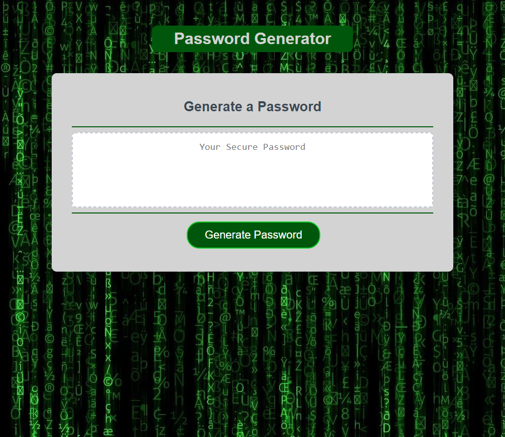

# WashU Bootcamp Homework, Week Three

## Table of Contents

I. Description
II. Project screenshot
III. Link to deployed page

## I. Description

Week three homework.  
Creating a Passsword Generator using the provided mock-up and Acceptance Criteria.
Creating a repository on Github, and deploy the page to a live URL.
Acceptance Criteria include:
Prompts for password criteria - length, between 8 and 128 - and whether any of the following are needed:
uppercase letters,
lowercase letters,
numbers,
special characters. Returned password should display to the page and contain at least one of any required character type.

## II. Project screenshot

## III. Link to deployed page

https://mikechampion.github.io/Password_Generator/
